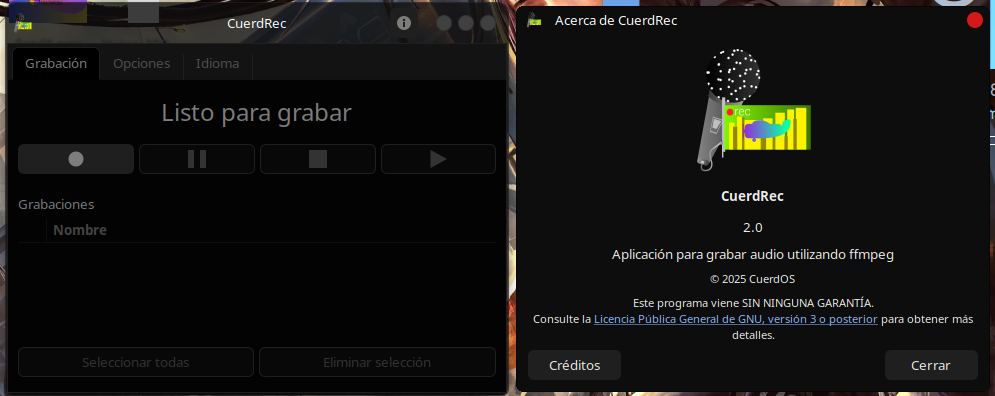

# CuerdRec

<p align="center">
  
</p>

<p align="center">
  
</p>


**CuerdRec** es un grabador de sonidos ligero y fácil de usar para CuerdOS GNU/Linux. Está construido con **Python**, **GTK/Qt**, **ffmpeg** y **Lua**, ofreciendo una herramienta eficiente para grabar audio de alta calidad.

## Características

- **Ligero y rápido**: Ideal para sistemas con recursos limitados.
- **Interfaz gráfica intuitiva**: Construido con **GTK**/Qt para ofrecer una experiencia de usuario accesible.
- **Compatible con varios formatos de audio**: Gracias a la integración de **ffmpeg**, soporta una amplia gama de formatos.
- **Fácil de usar**: Permite grabaciones rápidas sin complicaciones.

## Distros Compatibles

- **Debian 12+**, **MX Linux 21+**, **Linux Mint (Base Debian/Ubuntu)**, **KDE Neón**, **antiX**, **PeppermintOS (Base Debian/Devuan)**, **wattOS**, **Huayra**

## Requisitos

- **Python 3.x**
- **GTK 3.0** o **Qt 5+**
- **ffmpeg** instalado en el sistema
- Requiere un acompañante de camára, recomendados: **Webcamoid**, **Lomiri Camera**, **GNOME Cheese** o **guvcview**

## Instalación

Clona el repositorio y ejecuta la aplicación:

```bash
git clone https://github.com/gatoverde95/CuerdRec.git
cd CuerdRec
python3 cuerdrec.py
```

## Contribuir

Si deseas colaborar en el desarrollo de **CuerdRec**, síguenos en [GitHub](https://github.com/gatoverde95/CuerdRec) y envía tus **Pull Requests** o reporta errores en la sección de **Issues**.

## Licencia

Este proyecto está licenciado bajo la **GPLv3**. Puedes consultar el archivo `LICENSE` para más información.

---

> **Autor:** [gatoverde95](https://github.com/gatoverde95)  
> **Repositorio:** [CuerdRec](https://github.com/gatoverde95/CuerdRec)
